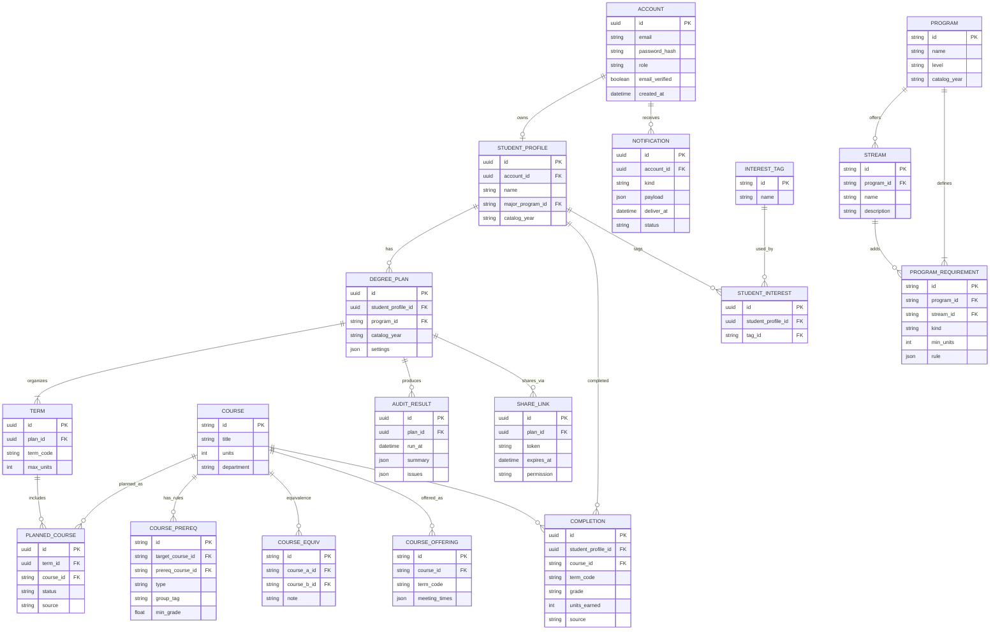
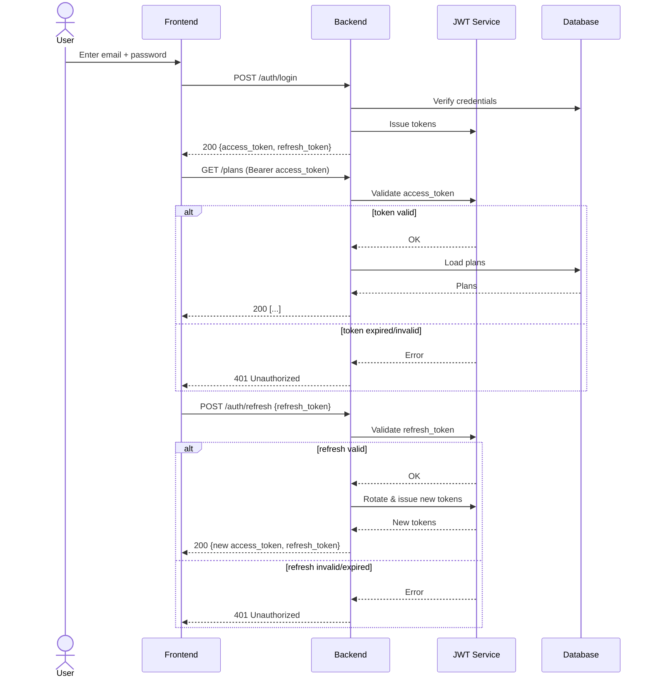

# Entity Relationship Diagram (ERD)

```mermaid
erDiagram
  ACCOUNT ||--o| STUDENT_PROFILE : owns
  ACCOUNT ||--o{ NOTIFICATION : receives
  STUDENT_PROFILE ||--o{ DEGREE_PLAN : has
  STUDENT_PROFILE ||--o{ COMPLETION : completed
  STUDENT_PROFILE ||--o{ STUDENT_INTEREST : tags
  INTEREST_TAG ||--o{ STUDENT_INTEREST : used_by

  DEGREE_PLAN ||--|{ TERM : organizes
  TERM ||--o{ PLANNED_COURSE : includes
  COURSE ||--o{ PLANNED_COURSE : planned_as
  DEGREE_PLAN ||--o{ AUDIT_RESULT : produces
  DEGREE_PLAN ||--o{ SHARE_LINK : shares_via

  PROGRAM ||--o{ STREAM : offers
  PROGRAM ||--|{ PROGRAM_REQUIREMENT : defines
  STREAM ||--o{ PROGRAM_REQUIREMENT : adds

  COURSE ||--o{ COURSE_PREREQ : has_rules
  COURSE ||--o{ COURSE_EQUIV : equivalence
  COURSE ||--o{ COURSE_OFFERING : offered_as
  COURSE ||--o{ COMPLETION : completed_as

  ACCOUNT {
    uuid id PK
    string email
    string password_hash
    string role
    boolean email_verified
    datetime created_at
  }

  STUDENT_PROFILE {
    uuid id PK
    uuid account_id FK
    string name
    string major_program_id FK
    string catalog_year
  }

  PROGRAM {
    string id PK
    string name
    string level
    string catalog_year
  }

  STREAM {
    string id PK
    string program_id FK
    string name
    string description
  }

  PROGRAM_REQUIREMENT {
    string id PK
    string program_id FK
    string stream_id FK
    string kind
    int min_units
    json rule
  }

  COURSE {
    string id PK
    string title
    int units
    string department
  }

  COURSE_PREREQ {
    string id PK
    string target_course_id FK
    string prereq_course_id FK
    string type
    string group_tag
    float min_grade
  }

  COURSE_EQUIV {
    string id PK
    string course_a_id FK
    string course_b_id FK
    string note
  }

  COURSE_OFFERING {
    string id PK
    string course_id FK
    string term_code
    json meeting_times
  }

  DEGREE_PLAN {
    uuid id PK
    uuid student_profile_id FK
    string program_id FK
    string catalog_year
    json settings
  }

  TERM {
    uuid id PK
    uuid plan_id FK
    string term_code
    int max_units
  }

  PLANNED_COURSE {
    uuid id PK
    uuid term_id FK
    string course_id FK
    string status
    string source
  }

  COMPLETION {
    uuid id PK
    uuid student_profile_id FK
    string course_id FK
    string term_code
    string grade
    int units_earned
    string source
  }

  AUDIT_RESULT {
    uuid id PK
    uuid plan_id FK
    datetime run_at
    json summary
    json issues
  }

  SHARE_LINK {
    uuid id PK
    uuid plan_id FK
    string token
    datetime expires_at
    string permission
  }

  NOTIFICATION {
    uuid id PK
    uuid account_id FK
    string kind
    json payload
    datetime deliver_at
    string status
  }

  INTEREST_TAG {
    string id PK
    string name
  }

  STUDENT_INTEREST {
    uuid id PK
    uuid student_profile_id FK
    string tag_id FK
  }
```
##Authentication flow

```mermaid
sequenceDiagram
  actor U as User
  participant FE as Frontend
  participant API as Backend
  participant AUTH as JWT Service
  participant DB as Database

  %% Login (context)
  U->>FE: Enter email + password
  FE->>API: POST /auth/login
  API->>DB: Verify credentials
  API->>AUTH: Issue tokens
  API-->>FE: 200 {access_token, refresh_token}

  %% Protected request
  FE->>API: GET /plans (Bearer access_token)
  API->>AUTH: Validate access_token
  alt token valid
    AUTH-->>API: OK
    API->>DB: Load plans
    DB-->>API: Plans
    API-->>FE: 200 [...]
  else token expired/invalid
    AUTH-->>API: Error
    API-->>FE: 401 Unauthorized
  end

  %% Refresh
  FE->>API: POST /auth/refresh {refresh_token}
  API->>AUTH: Validate refresh_token
  alt refresh valid
    AUTH-->>API: OK
    API->>AUTH: Rotate & issue new tokens
    AUTH-->>API: New tokens
    API-->>FE: 200 {new access_token, refresh_token}
  else refresh invalid/expired
    AUTH-->>API: Error
    API-->>FE: 401 Unauthorized
  end

```
##System Arhitecture
